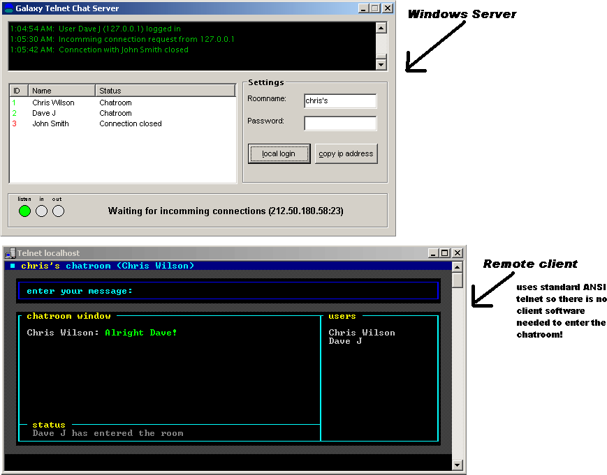



## ANSI Telnet Chatroom Server

### Description

ANSI Telnet Chatroom Server.

Open this server and people will be able to connect to your computer and chat to each other using any telnet application from any operating system.

Uses ANSI for a better GUI

See screenshot
 
### More Info
 

             |
---                |---
**Submitted On**   |2002-03-27 01:00:46
**By**             |[Chris Wilson UK](https://github.com/Planet-Source-Code/PSCIndex/blob/master/ByAuthor/chris-wilson-uk.md)
**Level**          |Advanced
**User Rating**    |4.6 (83 globes from 18 users)
**Compatibility**  |VB 5\.0, VB 6\.0
**Category**       |[Complete Applications](https://github.com/Planet-Source-Code/PSCIndex/blob/master/ByCategory/complete-applications__1-27.md)
**World**          |[Visual Basic](https://github.com/Planet-Source-Code/PSCIndex/blob/master/ByWorld/visual-basic.md)
**Archive File**   |[ANSI\_Telne657103262002\.zip](https://github.com/Planet-Source-Code/chris-wilson-uk-ansi-telnet-chatroom-server__1-33105/archive/master.zip)

